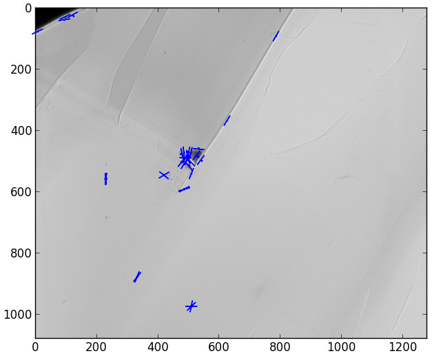

General introduction to SIFT_PyOCL
==================================

SIFT_PyOCL, a parallel version of SIFT algorithm
------------------------------------------------

SIFT (Scale-Invariant Feature Transform) is an algorithm developped by David Lowe in 1999. It is a worldwide reference for image alignment and object recognition. The robustness of this method enables to detect features at different scales, angles and illumination of a scene. SIFT_PyOCL is an implementation of SIFT in OpenCL, meaning that it can run on Graphics Processing Units and Central Processing Units as well. Interest points are detected in the image, then data structures called *descriptors* are built to be characteristic of the scene, so that two different images of the same scene have similar descriptors. They are robust to transformations like translation, rotation, rescaling and illumination change, which make SIFT interesting for image stitching. In the fist stage, descriptors are computed from the input images. Then, they are compared to determine the geometric transformation to apply in order to align the images. SIFT_PyOCL can run on most graphic cards and CPU, making it usable on many setups. OpenCL processes are handled from Python with PyOpenCL, a module to access OpenCL parallel computation API.

Introduction
------------

The European Synchrotron Radiation Facility (ESRF) beamline ID21 developed a full-field method for X-ray absorption near-edge spectroscopy (XANES). Since the flat field images are not acquired simultaneously with the sample transmission images, a realignment procedure has to be performed. SIFT is currently used, but takes about 8 seconds per frame, and one stack can have up to 500 frames. It is a bottleneck in the global process, therefore a parallel version of this algorithm can provide a crucial speed-up.

SIFT descriptors computation
----------------------------

Before image alignment, descriptors have to be computed from each image. The whole process can be launched by several lines of code.

How to use it
.............

SIFT_PyOCL can be installed as a standard Debian package, or with ``python setup.py build``. It generates a library that can be imported, then used to compute a list of descriptors from an image. The image can be in RGB values, but all the process is done on grayscale values. One can specify the device, either CPU or GPU. Although being integrated in EDNA framework for online image alignment, and thus mostly used by developers, SIFT_PyOCL provides example scripts.

.. code-block:: python

   python test/demo.py --type=GPU my_image.jpg

This computes and shows the keypoints on the input image.
One can also launch SIFT_PyOCL interactively with iPython :

.. _example1:
.. code-block:: python

   import sift
   import numpy
   import scipy.misc
   image_rgb = scipy.misc.imread("../my_image.jpg")
   sift_ocl = sift.SiftPlan(template=image_rgb, device=GPU)
   kp = sift_ocl.keypoints(image_rgb)
   kp.sort(order=["scale", "angle", "x", "y"])
   print kp

SIFT_PyOCL Files
................

The Python sources are in the ``sift-src`` folder. The file ``plan.py`` executes the whole process, from kernel compilation to descriptors computation. The OpenCL kernels in the "openCL" folder are compiled on the fly. Several kernels have multiple implementations, depending the architecture to run on.

Overall process
***************

The different steps of SIFT are handled by ``plan.py``. When launched, it automatically choose the best device to run on, unless a device is explicitly provided in the options. All the OpenCL kernels that can be compiled are built on the fly.
 

Image matching and alignment
----------------------------

There is a demo file ``demo_match.py`` that can be run to have a keypoints matching demonstration. Matching can also be run from ipython : suppose we got two list of keypoints ``kp1`` and ``kp2`` according to example1_.

.. _example2:
.. code-block:: python

   mp = sift.MatchPlan()
   match = mp.match(kp1, kp2)
   print("Number of Keypoints with for image 1 : %i, For image 2 : %i, Matching keypoints: %i" % (kp1.size, kp2.size, match.shape[0]))

Performances
------------

The aim of SIFT_PyOCL is to fasten the image alignment by running it on GPU.

.. figure:: img/bench_gpu_res.png
   :align: center
   :alt: Benchmark GPU vs CPU

SIFT parameters
---------------

Command line parameters
.......................

When launched from the command line, SIFT_PyOCL can handle several options like the device to run on and the *number of pixels per keypoint*. By default ``PIX_PER_KP`` is 10, meaning that we gess one keypoint will be found for every 10 pixels. This is for buffers allocation on the device, as the number of keypoints that will be found is unknown, and strongly depends of the type of image. 10 pixels per keypoint is a high estimation, even for images with many features like landscapes. For example, this 5.8 MPixels image_ gives about 2500 keypoints, which makes 2270 pixels per keypoints.
.. _image: http://www.lightsources.org/imagebank/image/esr032
If you have big images with few features and the image does not fit on the GPU, you can augment ``PIX_PER_KP`` in the command line options in order to decrease the amount of memory required.

Advanced SIFT parameters
........................

The file ``param.py`` contains SIFT default parameters, recommended by David Lowe in his paper_ or by the authors of the C++ version in ASIFT_. You should not modify these values unless you know what you are doing. Some parameters require to understand several aspects of the algorithm, explained in Lowe's original paper.

.. _paper: www.cs.ubc.ca/~lowe/papers/ijcv04.pdf
.. _ASIFT: http://www.ipol.im/pub/art/2011/my-asift

``DoubleImSize`` (0 by default) is for the pre-blur factor of the image. At the beginning, the original image is blurred (*prior-smoothing*) to eliminate noise. The standard deviation of the gaussian filter is either ``1.52`` if DoubleImSize is 0, or ``1.25`` if DoubleImSize is 1. Setting this parameter to 1 decrease the prior-smoothing factor, the algorithm will certainly find more keypoints but less accurate.

``InitSigma`` (1.6 by default) is the prior-smoothing factor. The original image is blurred by a gaussian filter which standard deviation is :math:`\sqrt{\text{InitSigma}^2 - c^2}`. with ``c == 0.5`` if ``DoubleImSize == 0`` or ``c == 1`` otherwise. If the prior-smoothing factor is decreased, the algorithm will certainly find more keypoint, but they will be less accurate.

``BorderDist`` (5 by default) is the minimal distance to borders : pixels that are less than ``BorderDist`` pixels from the border will be ignored for the processing. If features are likely to be near the borders, decreasing this parameter will enable to detect them.

``Scales`` (3 by default) is the number of Difference of Gaussians (DoG) that will actually be used for keypoints detection. In the gaussian pyramid, Scales+3 blurs are made, from which Scales+2 DoGs are computed. The DoGs in the middle are used to detect keypoints in the scale-space. If ``Scales`` is 3, there will be 6 blurs and 5 DoGs in an octave, and 3 DoGs will be used for local extrema detection. Increasing Scales will make more blurred images in an octave, so SIFT can detect a few more strong keypoints. However, it will slow the algorithm for a few keypoints.

``PeakThresh`` (255 * 0.04/3.0 by default) is the grayscale threshold for keypoints refinement. To discard low-contrast keypoints, every pixel which grayscale value is below this threshold can not become a keypoint. Decreasing this threshold will lead to a larger number of keypoints, which can be useful for detecting features in low-contrast areas.

``EdgeThresh`` (0.06 by default) and ``EdgeThresh1`` (0.08 by default) are the limit ratio of principal curvatures while testing if keypoints are located on an edge. Those points are not reliable for they are sensivite to noise. For such points, the principal curvature across the edge is much larger than the principal curvature along it. Finding these principal curvatures amounts to solving for the eigenvalues of the second-order Hessian matrix of the current DoG. The ratio of the eigenvalues :math:`r` is compared to a threshold :math:`\dfrac{(r+1)^2}{r} < R` with R defined by taking r=10, which gives :math:`\frac{(r+1)^2}{r} = 12.1`, and 1/12.1 = 0.08. In the first octave, the value 0.06 is taken instead of 0.08. Decreasing these values lead to a larger number of keypoints, but sensivite to noise because they are located on edges.

``OriSigma`` (1.5 by default) is related to the radius of gaussian weighting in orientation assignment. In this stage, for a given keypoint, we look in a region of radius :math:`3 \times s \times \text{OriSigma}` with :math:`s` the scale of the current keypoint. Increasing it will not lead to increase the number of keypoints found ; it will take a larger area into account while computing the orientation assignment.

``MatchRatio`` (0.73 by default) is the threshold used for image alignment. Descriptors are compared with a :math:`L^1`-distance. For a given descriptor, if the ratio between the closest-neighbor the second-closest-neighbor is below this threshold, then a matching is added to the list. Increasing this value leads to a larger number of matchings, certainly less accurate.

Region of Interest for image alignment
......................................

When processing the image matching, a region of interest (ROI) can be specified on the image. It is a binary image which can have any shape. For instance, if a sample is centered on the image, the user can select the center of the image before processing. 

It both fastens the processing and avoids to do match keypoints that are not on the sample.

References
..........

- David G. Lowe, Distinctive image features from scale-invariant keypoints, International Journal of Computer Vision, vol. 60, no 2, 2004, p. 91–110
http://www.cs.ubc.ca/~lowe/papers/ijcv04.pdf

